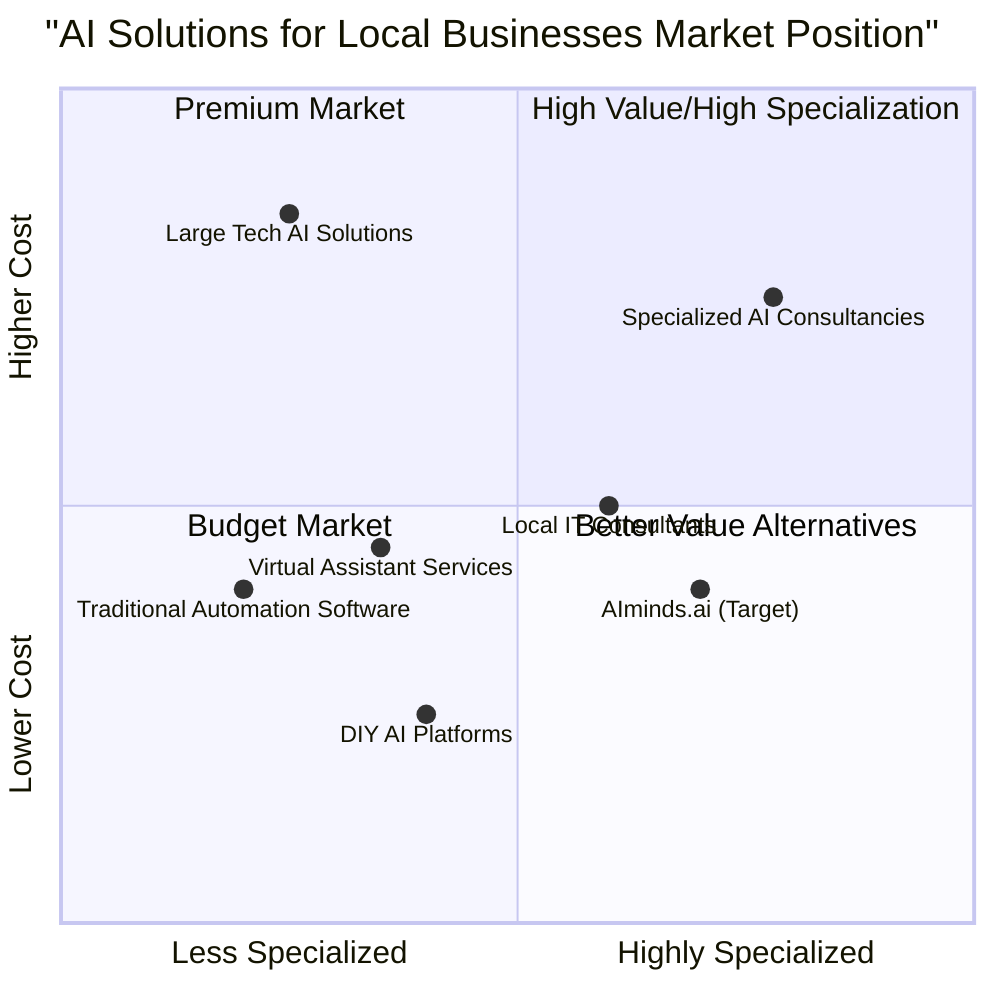

# AIminds.ai Website Product Requirements Document (PRD)

## 1. Introduction

### 1.1 Purpose
This Product Requirements Document (PRD) outlines the detailed specifications for developing the AIminds.ai website. The website aims to showcase the company's AI automation services, particularly personalized AI assistants for local businesses and professionals, while generating quality leads and educating potential clients.

### 1.2 Project Overview
AIminds.ai is an AI automation agency specializing in personalized AI assistants for local businesses and professionals. The website will serve as the primary digital touchpoint for potential clients, demonstrating AI capabilities while providing educational content and lead generation tools.

### 1.3 Original Requirements
The website should position AIminds.ai as an innovative leader, showcase practical AI applications, generate quality leads, educate clients, and demonstrate AI capabilities interactively. The target audience includes local business owners (in real estate, education, coaching, healthcare, food establishments), SMEs, and professionals seeking automation solutions.

## 2. Product Goals and Objectives

### 2.1 Primary Goals (P0)
1. Position AIminds.ai as an innovative leader in AI automation for local businesses
2. Generate high-quality leads from target industries
3. Demonstrate practical AI applications through interactive elements

### 2.2 Secondary Goals (P1)
1. Educate potential clients about AI capabilities and benefits
2. Build trust through case studies and testimonials
3. Showcase the process and methodology used by AIminds.ai

### 2.3 Nice-to-Have Goals (P2)
1. Establish a knowledge hub through blog/resources section
2. Create a community of businesses benefiting from AI adoption
3. Provide self-service tools for preliminary assessment of AI needs

## 3. User Stories

### 3.1 Primary User Stories (P0)
1. As a local business owner, I want to understand how AI can help my specific business type, so that I can determine if it's worth investing in.
2. As a professional considering AI adoption, I want to see concrete examples of implementation and results, so that I can justify the investment.
3. As a potential client, I want to easily schedule a consultation or demo, so that I can learn more about the service without friction.
4. As a website visitor, I want to interact with an AI assistant on the website, so that I can experience the technology firsthand.

### 3.2 Secondary User Stories (P1)
1. As a business owner with limited technical knowledge, I want clear explanations of AI capabilities, so that I can understand the technology without technical jargon.
2. As a potential client, I want to calculate potential ROI from implementing an AI assistant, so that I can make an informed decision.
3. As a visitor interested in AI, I want to access educational resources, so that I can learn more about AI applications for businesses.

## 4. Competitive Analysis

### 4.1 Direct Competitors
1. **AI Business Solutions**: 
   - Pros: Strong technical expertise, comprehensive service offerings
   - Cons: Complex pricing, limited focus on local businesses

2. **Virtual Assistant Providers**: 
   - Pros: Established market presence, scalable solutions
   - Cons: Often human-based rather than true AI, limited customization

3. **Local IT Consultants with AI Services**: 
   - Pros: Local presence, personalized service
   - Cons: Limited AI expertise, smaller scale capabilities

4. **Large Tech Companies' AI Solutions**: 
   - Pros: Advanced technology, established reputation
   - Cons: Expensive, not tailored to small business needs, impersonal service

5. **DIY AI Platform Providers**: 
   - Pros: Lower cost, self-service options
   - Cons: Requires technical knowledge, limited support, generic solutions

### 4.2 Indirect Competitors
1. **Traditional Business Automation Software**: 
   - Pros: Established market, proven track record
   - Cons: Less adaptive than AI, requires more human intervention

2. **Human Virtual Assistant Services**: 
   - Pros: Human touch, no learning curve
   - Cons: Higher long-term costs, limited availability, human error

### 4.3 Competitive Quadrant Chart



## 5. Website Requirements

### 5.1 Global Design & Branding

#### 5.1.1 Color Palette (P0)
- Primary: Deep blue (#1a365d) - For main structural elements, buttons, and areas conveying trust
- Secondary: Vibrant teal (#0abab5) - For accents, calls-to-action, highlighting innovation
- Accent: Warm orange (#ff7d00) - For key CTAs and elements needing energetic focus
- Backgrounds: Light gray (#f8f9fa) and white (#ffffff) for clean, modern feel

#### 5.1.2 Typography (P0)
- Headings: 'Montserrat' or 'Exo' font family (bold, futuristic yet readable)
- Body Text: 'Open Sans' or 'Roboto' font family (clean, professional readability)

#### 5.1.3 Imagery Style (P0)
- Abstract visualizations representing AI/data/networks using brand colors
- Authentic photographs of diverse local business owners interacting with technology
- Subtle animations demonstrating AI workflows or data processing concepts
- Custom illustrations explaining AI integration with specific business types

### 5.2 Page-Specific Requirements

#### 5.2.1 Homepage (P0)

##### Hero Section
- Full-width hero section
- Headline: 'AIminds.ai: Empowering Local Businesses with Personalized AI Assistants'
- Sub-headline explaining core benefits
- Dynamic abstract animation incorporating brand colors
- Primary CTA button: 'Get Your Custom AI Demo'

##### Interactive AI Greeter
- AI assistant chat widget visible immediately
- Initial greeting to welcome visitors and offer navigation assistance
- Must demonstrate AIminds.ai capability

##### Industry Quick Select
- Visually engaging section with distinct buttons/cards for key target industries
- Include: Real Estate, Education, Coaching, Healthcare, Food Establishments, Other Professionals
- Each links to respective Industry Solutions page

##### Value Proposition/Stats
- Animated statistics showcasing key benefits
- Examples: Task reduction percentage, lead response time improvement, average monthly savings
- Use counters or simple animated graphs

##### How It Works Overview
- Simplified 3-4 step visual overview of the process
- Steps: Consultation -> Customization -> Integration -> Support

##### Testimonial Snippet
- 1-2 concise client quotes with names and business types

##### Footer CTA
- Clear call-to-action leading to contact/consultation page

#### 5.2.2 Industry Solutions Pages (P0)

Create template-based pages for each target industry: Real Estate, Education, Coaching, Healthcare, and Food Establishments. Each page must include:

##### Specific Industry Headline
- Example: 'AI Assistants Tailored for Real Estate Agents'

##### Industry Pain Points
- List common challenges specific to that industry that AI can address

##### AIminds.ai Solutions
- Detail how personalized AI assistants solve these specific pain points
- Industry-specific examples of automation capabilities

##### Interactive Demo Element
- Embed or link to interactive element showcasing a simplified AI function relevant to that industry
- Example: Lead qualifier for real estate, automated FAQ responder for coaches

##### Case Studies
- At least one detailed case study with measurable results
- Example metrics: Admin time reduction, client booking increases

##### Video Testimonials
- Space for video testimonials from clients within that industry

##### Relevant CTA
- Industry-specific call to action
- Example: 'See How AI Can Transform Your [Industry Name] Business'

#### 5.2.3 Technology Showcase Page (P0)

##### Interactive Demos Section
- Allow visitors to interact with simplified, pre-configured AI assistant demos
- Demonstrate core capabilities: text generation, data classification, scheduling simulation

##### Customization Explanation
- Visual and textual explanation of the customization process
- Diagrams or animations showing how AIminds.ai tailors AI models

##### AI Learning Visualization
- Conceptual visualization showing how AI learns and improves over time
- Animated or static illustration depicting the learning process

##### Integration Capabilities
- List logos and brief descriptions of common business tools AIminds.ai can integrate with
- Examples: CRM systems, scheduling software, communication platforms

#### 5.2.4 Process & Pricing Page (P0)

##### Implementation Process
- Clear outline of steps from consultation to deployment and support
- Visual timeline or step-by-step graphic

##### Timeline Visualization
- Estimated timeframes for each implementation stage

##### Interactive Pricing Calculator (P1)
- Tool for selecting parameters to get estimated pricing range
- Parameters: business size, number of tasks to automate, customization level
- Include disclaimer that final pricing requires consultation

##### Value Comparison
- Compare estimated cost and benefits vs. hiring human assistant or using generic tools
- Highlight: consistency, 24/7 availability, scalability

#### 5.2.5 About Us Page (P1)

##### Founder's Vision
- Section on motivation behind AIminds.ai
- Focus on democratizing AI for local businesses and supporting local economic growth

##### Team Section
- Showcase key team members with photos and brief bios
- Highlight expertise in AI, software development, and small business needs

##### Mission Statement
- Clear statement of company mission

##### Company Values
- List core values: Innovation, Accessibility, Ethics, Partnership, Client Success

#### 5.2.6 Blog/Resources Section (P1)

##### Article Layout
- Clean template for blog posts/articles

##### Content Categories
- Categories: AI Capabilities, Industry Use Cases, Productivity Tips, AI News & Innovations, Client Success Stories

##### Functionality
- Search functionality and category filtering

##### Engagement
- Social sharing buttons on each post

#### 5.2.7 Contact/Consultation Page (P0)

##### Interactive Intake Form
- AI-like interaction or multi-step conversational form
- Gather initial information: name, business type, needs, contact info

##### Calendar Integration
- Embedded calendar booking tool for scheduling demos/consultations

##### Live Chat
- Live chat widget with hybrid AI/human support
- AI handles initial queries, escalates to human agents when needed

##### Direct Contact Info
- Alternative contact methods: email address, phone number

##### Map/Location (P2)
- Optional map showing service area or office location

### 5.3 Interactive Elements

#### 5.3.1 AI Chatbot (P0)
- Persistent across most pages via floating icon
- Maintains context where possible
- Offers relevant help based on current page

#### 5.3.2 ROI Calculator (P1)
- Interactive tool allowing input of variables: time spent on tasks, employee cost, etc.
- Estimates potential time and cost savings with an AI assistant
- Link prominently from Industry Solutions and Pricing pages

#### 5.3.3 'Build Your Assistant' Wizard (P1)
- Multi-step wizard on Technology page or dedicated page
- Allow selection of industry, tasks to automate from predefined list
- Visual representation of potential custom AI assistant configuration
- Ends with CTA for detailed consultation

#### 5.3.4 Micro-interactions (P1)
- Subtle micro-interactions on buttons, form fields, loading states, hover effects
- Use brand colors (especially teal/orange)
- Should feel responsive and modern
- Subtly reinforce the AI theme

## 6. Technical Requirements

### 6.1 General Requirements (P0)

#### 6.1.1 Responsiveness
- Mobile-first approach
- Fully responsive across all common device sizes (desktop, tablet, mobile)

#### 6.1.2 Performance
- Optimize all images, scripts, and assets for fast loading speeds
- Target high score on Google PageSpeed Insights

#### 6.1.3 Accessibility
- Comply with WCAG 2.1 AA accessibility standards

#### 6.1.4 CRM Integration
- Configure all forms to integrate with specified CRM system
- Includes: Contact, Consultation, ROI Calculator results

#### 6.1.5 Analytics
- Set up Google Analytics tracking across the entire site
- Include event tracking for key conversions

#### 6.1.6 Privacy
- Include dedicated Privacy Policy page
- Ensure compliance with GDPR and relevant data privacy regulations
- Implement cookie consent banner

#### 6.1.7 Security
- Implement SSL security (HTTPS) across entire website

### 6.2 Development Stack

#### 6.2.1 Frontend (P0)
- React for component-based UI development
- JavaScript for interactive elements
- Tailwind CSS for styling

#### 6.2.2 Backend Requirements (P1)
- API endpoints for form submissions and interactive elements
- Integration with calendar booking system
- AI assistant chatbot backend support

## 7. Implementation Timeline

### 7.1 Phase 1: Core Website (P0)
- Homepage
- One Industry Solution page template
- Contact/Consultation page
- Global design elements
- Basic AI chatbot integration

### 7.2 Phase 2: Expansion (P1)
- Remaining Industry Solution pages
- Technology Showcase page
- Process & Pricing page with calculator
- 'Build Your Assistant' wizard
- Enhanced AI chatbot capabilities

### 7.3 Phase 3: Complete Rollout (P2)
- About Us page
- Blog/Resources section
- Additional interactive elements
- Advanced analytics and optimizations

## 8. Requirements Pool

### 8.1 Must-Have Requirements (P0)
1. Responsive website with core pages (Homepage, Industry Solutions, Contact)
2. Interactive AI chatbot demonstrating AI capabilities
3. Industry-specific content and case studies
4. Clear CTAs and lead generation forms
5. Visual design adhering to brand guidelines
6. Basic analytics tracking
7. Mobile-first design approach
8. HTTPS security implementation

### 8.2 Should-Have Requirements (P1)
1. Interactive ROI calculator
2. 'Build Your Assistant' wizard
3. Technology Showcase with interactive demos
4. Process & Pricing page with detailed information
5. Animated statistics and visual elements
6. Blog/Resources section with initial content
7. Integration with CRM system
8. Advanced analytics with event tracking

### 8.3 Nice-to-Have Requirements (P2)
1. Advanced AI chatbot with natural language processing
2. Video testimonials from clients
3. Community forum or discussion area
4. Multi-language support
5. Advanced personalization based on user behavior
6. Integrated newsletter subscription system
7. Dynamic content based on industry selection
8. Social media integration and live feeds

## 9. UI Design Draft

### 9.1 Homepage Layout

```
+----------------------------------------------------+
|  LOGO                             NAVIGATION MENU   |
+----------------------------------------------------+
|                                                    |
|  HERO SECTION                                      |
|  Headline: AIminds.ai: Empowering Local Businesses |
|  Subheadline: Explaining core benefits            |
|  CTA Button: Get Your Custom AI Demo              |
|  [Abstract AI Animation]                          |
|                                                    |
+----------------------------------------------------+
|                                                    |
|  INDUSTRY QUICK SELECT                             |
|  +-------+  +-------+  +-------+  +-------+       |
|  |Real   |  |Educat.|  |Coach. |  |Health |       |
|  |Estate |  |       |  |       |  |Care   |       |
|  +-------+  +-------+  +-------+  +-------+       |
|                                                    |
+----------------------------------------------------+
|                                                    |
|  VALUE PROPOSITION/STATS                           |
|  +-------------+  +-------------+  +-------------+ |
|  | Reduce tasks|  | Faster     |  | Average     | |
|  | by X%       |  | response   |  | savings: $Z | |
|  | [Animation] |  | [Animation]|  | [Animation] | |
|  +-------------+  +-------------+  +-------------+ |
|                                                    |
+----------------------------------------------------+
|                                                    |
|  HOW IT WORKS                                      |
|  +------+     +------+     +------+     +------+  |
|  |Step 1|---->|Step 2|---->|Step 3|---->|Step 4|  |
|  +------+     +------+     +------+     +------+  |
|                                                    |
+----------------------------------------------------+
|                                                    |
|  TESTIMONIALS                                      |
|  "Quote from satisfied client"                     |
|  - Client Name, Business Type                      |
|                                                    |
+----------------------------------------------------+
|                                                    |
|  FOOTER CTA                                        |
|  Ready to transform your business?                 |
|  [Schedule a Consultation] button                  |
|                                                    |
+----------------------------------------------------+
|                                                    |
|  FOOTER                                            |
|  Links | Contact | Social | Copyright              |
|                                                    |
+----------------------------------------------------+
|                                                    |
|  [AI Chatbot Icon - Fixed Position]                |
|                                                    |
+----------------------------------------------------+
```

### 9.2 Industry Solution Page Layout

```
+----------------------------------------------------+
|  LOGO                             NAVIGATION MENU   |
+----------------------------------------------------+
|                                                    |
|  INDUSTRY HEADER                                   |
|  AI Assistants Tailored for [Industry]            |
|                                                    |
+----------------------------------------------------+
|                                                    |
|  INDUSTRY PAIN POINTS                              |
|  +-------------+  +-------------+  +-------------+ |
|  | Pain Point 1|  | Pain Point 2|  | Pain Point 3| |
|  | Description |  | Description |  | Description | |
|  +-------------+  +-------------+  +-------------+ |
|                                                    |
+----------------------------------------------------+
|                                                    |
|  AIMINDS.AI SOLUTIONS                              |
|  [Illustration of industry-specific solution]      |
|  Detailed explanation of how AI solves pain points |
|                                                    |
+----------------------------------------------------+
|                                                    |
|  INTERACTIVE DEMO                                  |
|  [Interactive Element Specific to Industry]        |
|  Try it out: [Interactive Controls]                |
|                                                    |
+----------------------------------------------------+
|                                                    |
|  CASE STUDY                                        |
|  How [Business Name] Achieved [Result]             |
|  Challenge | Solution | Results                    |
|                                                    |
+----------------------------------------------------+
|                                                    |
|  VIDEO TESTIMONIALS                                |
|  [Video Player] [Video Player] [Video Player]      |
|                                                    |
+----------------------------------------------------+
|                                                    |
|  INDUSTRY-SPECIFIC CTA                             |
|  See How AI Can Transform Your [Industry] Business |
|  [Get Started] button                              |
|                                                    |
+----------------------------------------------------+
|                                                    |
|  FOOTER                                            |
|  Links | Contact | Social | Copyright              |
|                                                    |
+----------------------------------------------------+
|                                                    |
|  [AI Chatbot Icon - Fixed Position]                |
|                                                    |
+----------------------------------------------------+
```

## 10. Open Questions

1. What specific CRM system should the website integrate with?
2. Are there any existing branding materials or style guides to incorporate?
3. Who will provide the content for industry-specific pages and case studies?
4. What level of AI chatbot sophistication is expected for the initial launch?
5. Will the client provide access to testimonials and case studies, or should placeholders be used initially?
6. Is there a preference for hosting provider or deployment method?
7. What is the expected timeline for the complete website development?
8. Are there specific competitors that should be analyzed more deeply?
9. What metrics will be used to measure the success of the website?
10. What is the budget allocation for third-party tools or services (chatbot, calendar integration, etc.)?

## 11. Conclusion

This PRD outlines the comprehensive requirements for the AIminds.ai website. The document provides clear guidelines for design, content structure, functionality, and technical implementation. By following these requirements, the development team will create a website that effectively showcases AIminds.ai's capabilities, generates quality leads, and educates potential clients about the benefits of personalized AI assistants for local businesses and professionals.

Implementation should be phased, with focus first on core functionality (P0), followed by additional features (P1), and finally nice-to-have elements (P2). Regular reviews against this PRD will ensure the project stays aligned with business goals and user needs.