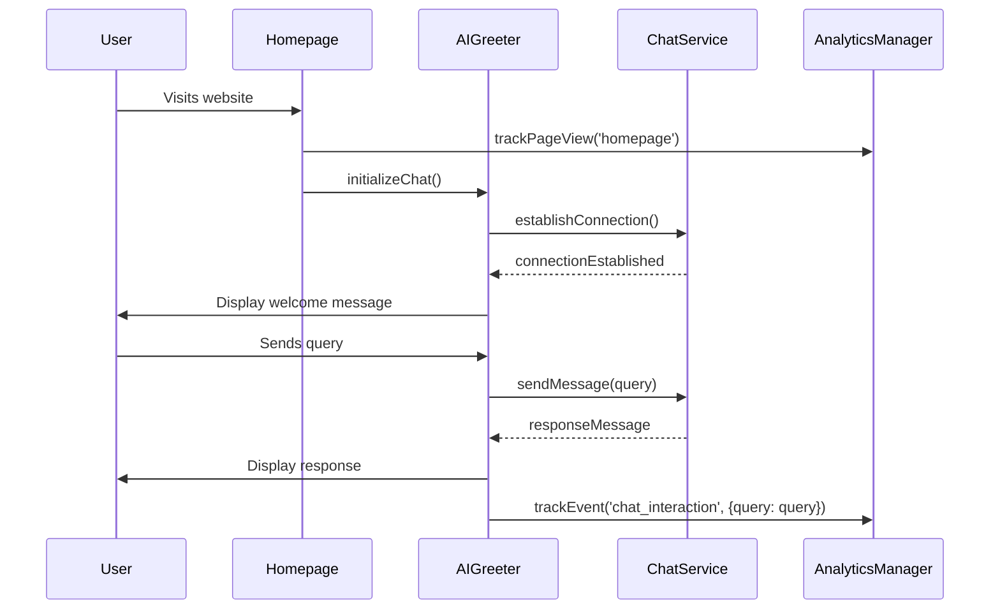
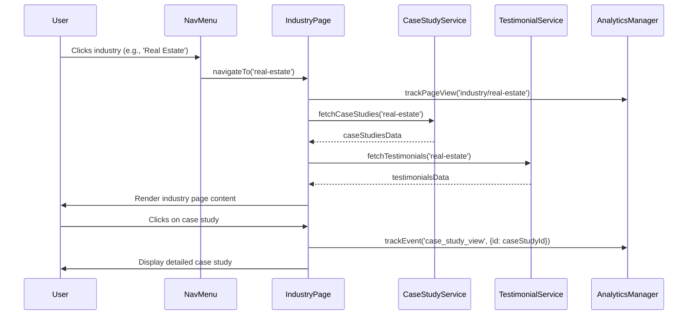
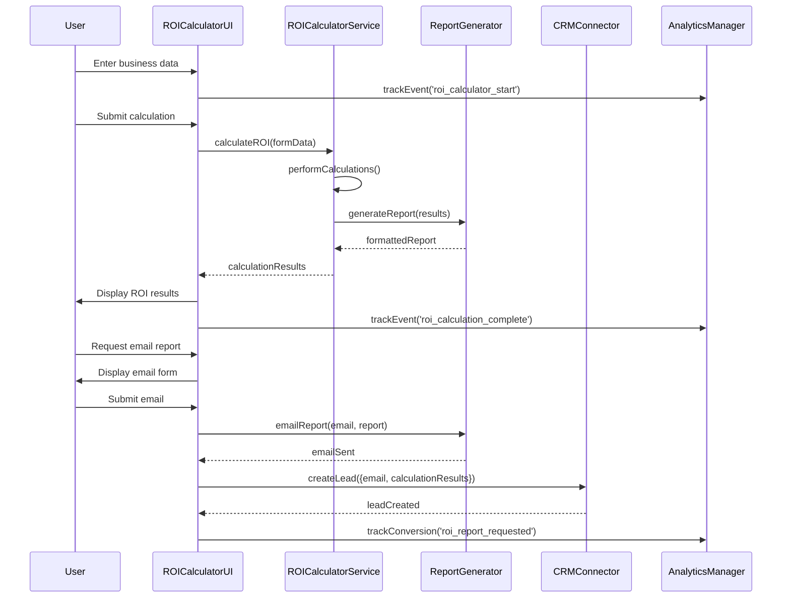
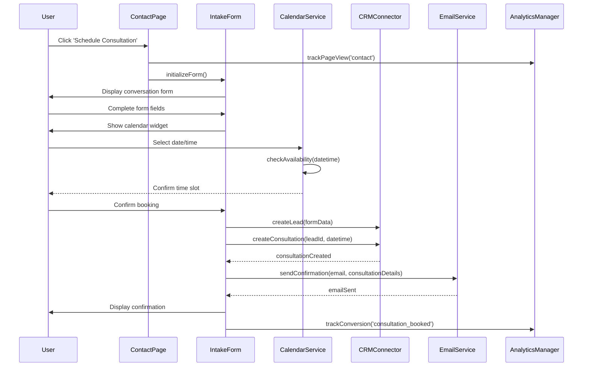
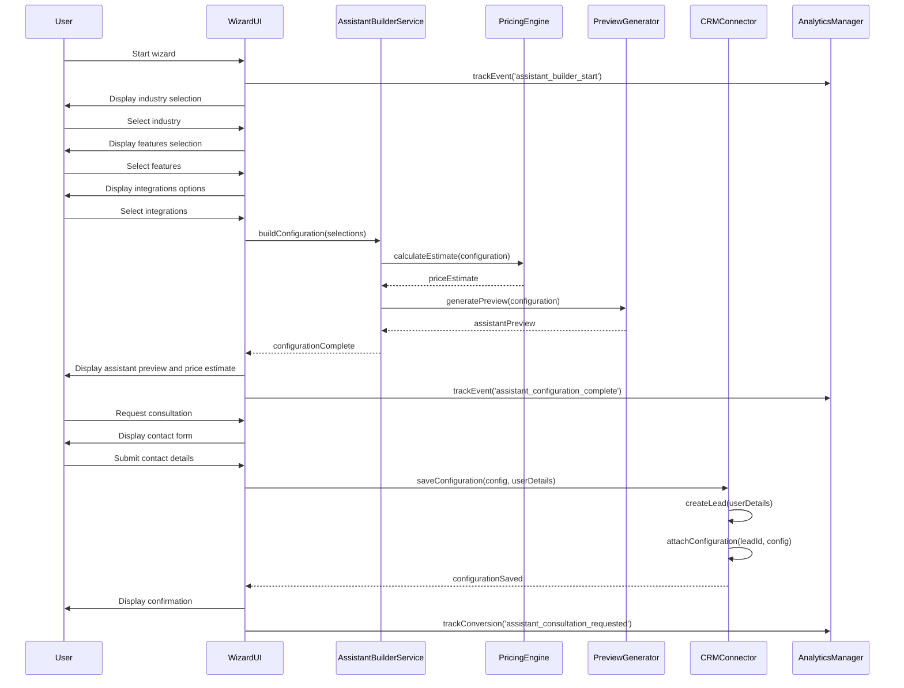

# AIminds.ai Website System Design

## Implementation approach

After analyzing the PRD for AIminds.ai website, we've identified the following key aspects that will influence our implementation approach:

1. **Interactive Components**: The website requires several interactive elements like AI chatbot, ROI calculator, and a 'Build Your Assistant' wizard that need real-time user interaction.

2. **Content Management**: Multiple industry-specific pages with tailored content need to be managed efficiently.

3. **Responsive Design**: The website must follow a mobile-first approach and be responsive across all devices.

4. **Performance Requirements**: The site needs to achieve high scores on PageSpeed Insights and deliver optimal user experience.

5. **Integration Points**: CRM integration, analytics, calendar booking, and potentially AI services need to be connected seamlessly.

### Technology Stack Selection

Based on the PRD requirements and the specified tech stack (React, JavaScript, Tailwind CSS), we'll implement a modern web architecture:

1. **Frontend Framework**: React.js with Next.js
   - Next.js provides server-side rendering (SSR) and static site generation (SSG) capabilities which will significantly improve performance and SEO
   - Component-based architecture aligns with the modular design needed for reusable elements across industry pages
   - Built-in routing system simplifies navigation structure

2. **Styling**: Tailwind CSS with custom theme configuration
   - Configure the theme with the specified color palette (#1a365d, #0abab5, #ff7d00, etc.)
   - Utilize Tailwind's responsive utility classes for mobile-first design
   - Create custom component classes for consistent UI elements

3. **Backend & API Layer**: Node.js with Express
   - Implement REST APIs for form submissions, chatbot interactions, and calculator computations
   - Server-side logic for CRM integration and data processing
   - Authentication for admin functions (content management)

4. **State Management**: React Context API with hooks for simpler state requirements, Redux for more complex states
   - Manage user interactions and form data
   - Store calculation results and wizard progress

5. **Third-party Integrations**:
   - CRM system integration via API
   - Google Analytics for tracking user behavior
   - Calendar service (like Calendly) for booking consultations
   - AI chatbot service (potentially using a service like Dialogflow or a custom implementation)

6. **Performance Optimization**:
   - Image optimization using Next.js Image component
   - Code splitting and lazy loading for non-critical components
   - Caching strategies for static content
   - CDN deployment for global access and speed

7. **Accessibility**:
   - Implement ARIA attributes and semantic HTML
   - Ensure keyboard navigation support
   - Maintain appropriate contrast ratios per WCAG 2.1 AA standards
   - Regular accessibility audits using tools like Lighthouse

8. **Security**:
   - HTTPS implementation
   - Form validation and sanitization
   - CSRF protection
   - Rate limiting for API endpoints
   - Proper CORS configuration

## Data structures and interfaces

The following class diagram outlines the core data structures and their relationships:

```mermaid
classDiagram
    class User {
        +string id
        +string name
        +string businessType
        +string email
        +string phone
        +Date createdAt
        +saveToDatabase() boolean
        +updateProfile(UserProfile) boolean
    }

    class Lead {
        +string id
        +string name
        +string businessType
        +string email
        +string phone
        +string source
        +string status
        +Array~string~ interests
        +Date createdAt
        +saveToDatabase() boolean
        +updateStatus(string) boolean
        +scheduleMeeting(Date) boolean
    }

    class Consultation {
        +string id
        +string leadId
        +Date scheduledTime
        +string status
        +Array~string~ notes
        +string meetingLink
        +createConsultation() boolean
        +reschedule(Date) boolean
        +cancel() boolean
        +addNote(string) boolean
    }

    class AIChatbot {
        +string sessionId
        +string currentPageContext
        +Array~Message~ messageHistory
        +initializeChat() void
        +sendMessage(string) Promise~Response~
        +handleUserInput(string) string
        +transferToHuman() boolean
        +updateContext(string) void
        +saveConversation() boolean
    }

    class Message {
        +string id
        +string sessionId
        +string content
        +string type
        +Date timestamp
        +saveMessage() boolean
    }

    class ROICalculator {
        +number employeeCost
        +number hoursPerTask
        +number tasksPerWeek
        +number automationEfficiency
        +calculateWeeklySavings() number
        +calculateMonthlySavings() number
        +calculateYearlySavings() number
        +getImplementationCost() number
        +calculateROI() number
        +generateReport() ROIReport
    }

    class ROIReport {
        +number weeklySavings
        +number monthlySavings
        +number yearlySavings
        +number implementationCost
        +number roi
        +number breakEvenMonths
        +Date generatedAt
        +saveReport() boolean
        +emailReport(string) boolean
    }

    class AssistantBuilder {
        +string industry
        +Array~string~ selectedFeatures
        +Array~string~ integrations
        +string complexity
        +addFeature(string) void
        +removeFeature(string) void
        +addIntegration(string) void
        +removeIntegration(string) void
        +calculateEstimatedPrice() number
        +generateAssistantPreview() AssistantPreview
        +saveConfiguration() boolean
    }

    class AssistantPreview {
        +string configId
        +string industry
        +Array~string~ features
        +Array~string~ integrations
        +number estimatedPrice
        +renderPreview() HTMLElement
        +saveAsLead(UserInfo) boolean
    }

    class CaseStudy {
        +string id
        +string industry
        +string businessName
        +string challenge
        +string solution
        +string results
        +Array~string~ metrics
        +string testimonial
        +Array~string~ mediaUrls
        +fetchByIndustry(string) Array~CaseStudy~
    }

    class BlogPost {
        +string id
        +string title
        +string content
        +string author
        +Date publishDate
        +Array~string~ categories
        +Array~string~ tags
        +string featuredImage
        +number views
        +fetchPosts(filters) Array~BlogPost~
        +searchPosts(string) Array~BlogPost~
    }

    class AnalyticsManager {
        +trackPageView(string) void
        +trackEvent(string, Object) void
        +trackConversion(string) void
        +getPageViewStats() Object
        +getEventStats() Object
        +getConversionRate() number
    }

    class CRMConnector {
        +createLead(Lead) boolean
        +updateLead(string, Lead) boolean
        +fetchLeads(filters) Array~Lead~
        +createTask(Task) boolean
        +syncCalendarEvents() boolean
    }

    Lead "1" -- "0..*" Consultation : schedules
    User "1" -- "0..*" Lead : becomes
    Lead "1" -- "0..*" AssistantPreview : configures
    AIChatbot "1" -- "0..*" Message : contains
    ROICalculator "1" -- "1" ROIReport : generates
    AssistantBuilder "1" -- "1" AssistantPreview : creates
    CRMConnector "1" -- "0..*" Lead : manages
    CRMConnector "1" -- "0..*" Consultation : schedules
    AnalyticsManager -- AIChatbot : tracks
    AnalyticsManager -- ROICalculator : tracks
    AnalyticsManager -- AssistantBuilder : tracks
```

## Program call flow

The following sequence diagrams illustrate key user interactions with the AIminds.ai website:

### 1. Homepage Visit and AI Chatbot Interaction

### 2. Industry Page Visit and Case Study Exploration

### 3. ROI Calculator Usage

### 4. Booking a Consultation

### 5. 'Build Your Assistant' Wizard Flow

## Anything UNCLEAR

1. **CRM System Selection**: The PRD mentions CRM integration but doesn't specify which CRM system will be used. Different CRMs have different APIs and integration approaches. This should be clarified before implementation.

2. **AI Chatbot Implementation**: The level of sophistication required for the AI chatbot needs clarification. Will it be a simple rule-based system, or should it incorporate more advanced NLP capabilities? Will it use a third-party service or be custom-built?

3. **Content Management System**: The PRD doesn't specify if a CMS is needed for managing blog posts and case studies. If frequent content updates are expected, implementing a headless CMS might be beneficial.

4. **User Authentication**: While the system primarily serves as a lead generation tool, it's unclear if there will be any authenticated user sections (e.g., for clients to access their AI assistant dashboards in the future).

5. **Deployment Environment**: The hosting environment and deployment strategy should be specified to optimize the architecture accordingly.

6. **Third-party Service Budgets**: Budget allocations for third-party services (chatbot APIs, calendar services, etc.) would help determine the most appropriate integration approaches.

7. **Data Privacy Requirements**: Beyond GDPR compliance, are there specific data handling requirements that should be considered in the architecture?

8. **Scalability Requirements**: Expected traffic volumes and growth projections would help in designing an appropriately scalable architecture.

9. **SEO Requirements**: The PRD doesn't mention SEO optimization requirements, which could impact the technical implementation, especially regarding SSR vs. CSR approaches.

10. **Analytics Integration Depth**: The level of analytics tracking required should be clarified. Basic page views and events, or more sophisticated user journey tracking and attribution models?